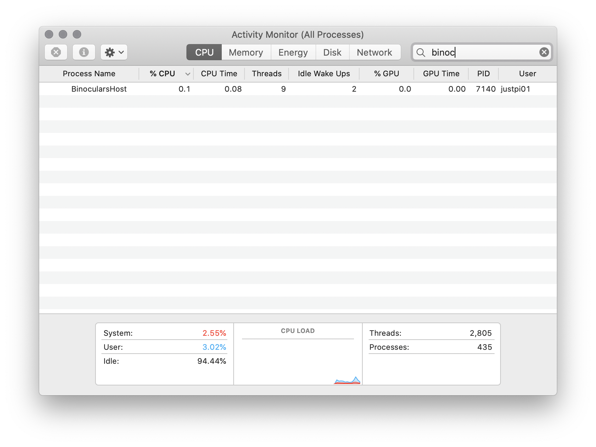

# readme

This is a quick project to test how `dotnet watch` works in order to determine whether it would be a good candidate for code hot swapping. Sample usage: https://docs.microsoft.com/en-us/aspnet/core/tutorials/dotnet-watch?view=aspnetcore-6.0

Tu run:

```
dotnet watch run --project BinocularsHost/BinocularsHost.fsproj
```

## conclusion

The tool is not for hot-swapping dependencies.

State not preserved:

```
watch : Started
0.      Hello Piotr!
1.      Hello Piotr!
2.      Hello Piotr!
3.      Hello Piotr!
4.      Hello Piotr!
watch : Exited
watch : File changed: /Users/justpi01/Documents/code/binoculars/BinocularsLib/Library.fs
watch : Started
watch : Exited
watch : File changed: /Users/justpi01/Documents/code/binoculars/BinocularsHost/bin/Debug/net6.0/BinocularsLib.dll
watch : Started
0.      Hello, Piotr!
1.      Hello, Piotr!
2.      Hello, Piotr!
3.      Hello, Piotr!
4.      Hello, Piotr!
5.      Hello, Piotr!
```

New PID assigned on dependency change:

